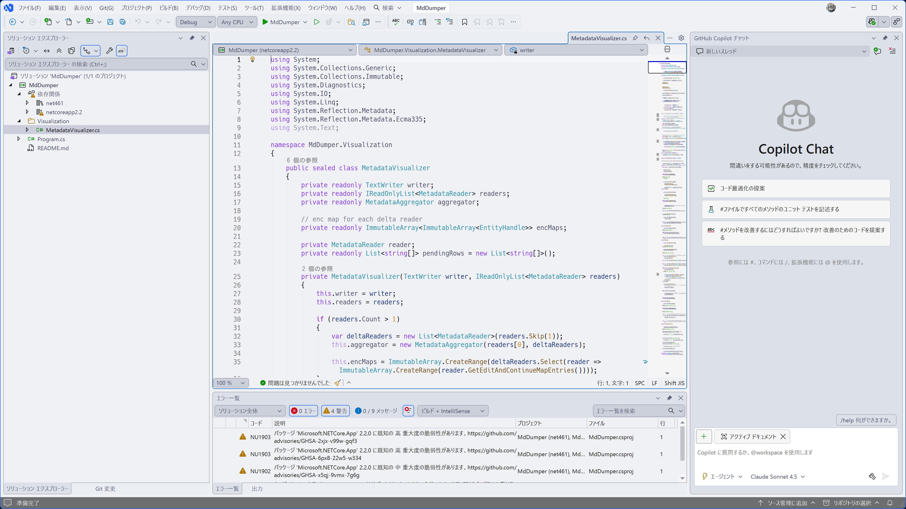
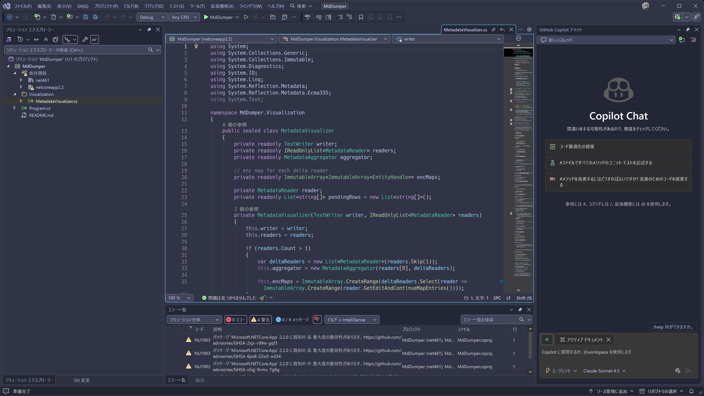
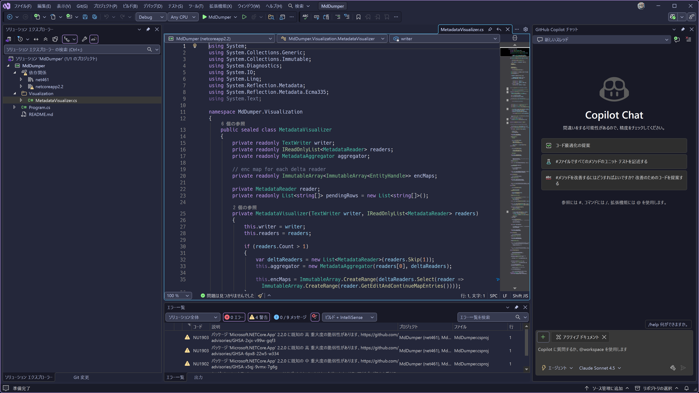
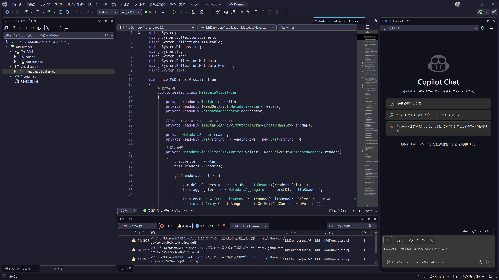

# Catppuccin Modern for Visual Studio (Unofficial)

An **unofficial Catppuccin-based theme extension for Visual Studio 2026**.

This theme was created primarily for personal use,  
with support for the Visual Studio 2026 theme extension system.

<p align="center">
   <a href="LICENSE.txtLICENSE"></a>
</p>

---

## Overview

This extension brings the well-known  
[Catppuccin](https://catppuccin.com/) pastel color palette to Visual Studio 2026.

- Compatible with Visual Studio 2026
- Designed with respect for Catppuccin’s color philosophy
- Falls back to the Visual Studio default theme for undefined tokens

### Preview

#### Latte



#### Frappé



#### Macchiato



#### Mocha



---

## Background

The existing *Catppuccin for Visual Studio* theme is currently in the process
of being updated for Visual Studio 2026, and at the time of creation,
an officially compatible version was not yet available.

Therefore, this theme was created:

- For use in my own development environment
- To better understand the Visual Studio 2026 theme extension specification

This repository is an **unofficial derivative project**  
and is not directly affiliated with the official Catppuccin project.

---

## Features

- Color scheme based on the Catppuccin palette
- Supports the new theme definition model introduced in Visual Studio 2026
- Primarily defines Editor, Text, and core UI tokens
- Undefined UI elements fall back to the Visual Studio default theme
- Simple structure intended for personal use

---

## Supported Environment

- Visual Studio 2026
- Windows 10 / Windows 11

---

## Installation

### Option 1: Install via VSIX (Recommended)

1. Download the `.vsix` file from GitHub Releases
2. Double-click the file to install
3. Restart Visual Studio
4. Navigate to  
   `Tools` → `Options` → `Environment` → `General` → `Color theme`  
   and select this theme

### Option 2: Build from Source (For Developers)

```bash
git clone https://github.com/sysCat64/CatppuccinModernForVisualStudio.git
